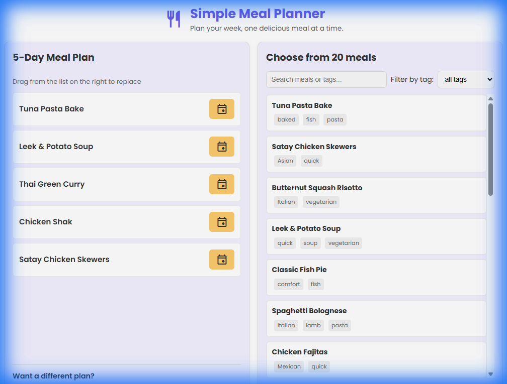
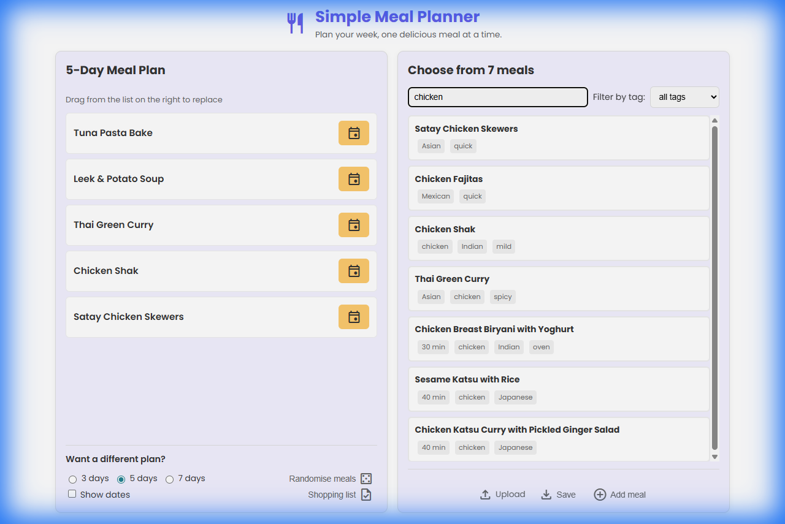
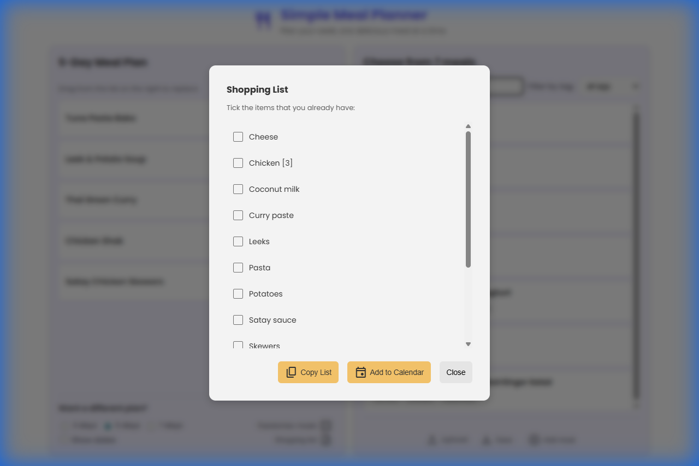
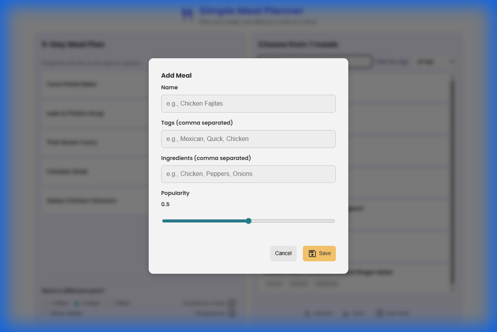
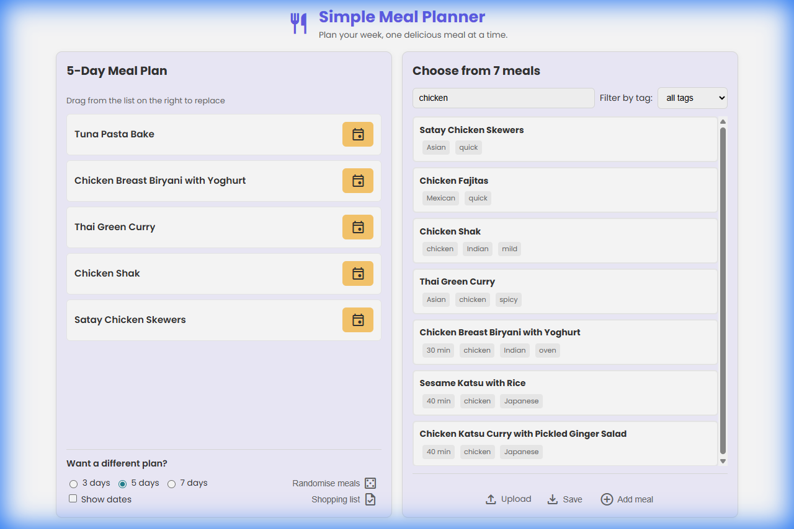

# 🍽️ Simple Meal Planner

**Plan your week, one delicious meal at a time.**

Say goodbye to the dreaded "What's for dinner?" question! **Simple Meal Planner** is your personal meal planning companion that makes weekly meal organization effortless, fun, and flexible. Whether you're planning for 3 days or a whole week, we've got you covered! 🎯

---

## ✨ Why You'll Love It

- **🎲 Smart Randomization**: Tired of eating the same things? Let our intelligent algorithm surprise you with meal suggestions based on popularity scores!
- **🎨 Drag & Drop Magic**: Don't like a suggestion? Simply drag and drop any meal from your database to replace it instantly!
- **🛒 Instant Shopping Lists**: Generate comprehensive shopping lists with one click - complete with calendar integration!
- **🔍 Powerful Search**: Find meals by name or tags in seconds
- **💾 Your Data, Your Way**: Import and export your meal database in JSON or CSV format
- **📱 Beautiful & Responsive**: Works seamlessly on desktop, tablet, and mobile devices
- **⚡ Lightning Fast**: No sign-ups, no servers, runs entirely in your browser!

---

## 🎬 See It In Action

### 📅 Main Interface - Your Weekly Meal Hub

The clean, intuitive interface shows your weekly meal plan on the left and your entire meal database on the right. Choose between 3, 5, or 7-day plans and customize them to your heart's content!

---

### 🔍 Smart Search & Filtering

Looking for something specific? Use our powerful search to filter by meal names or tags like "Mexican", "Quick", "Vegetarian" - find exactly what you're craving!

---

### 🛒 Shopping List Generator

One click generates your complete shopping list from your meal plan! Check off items you already have, copy the list to your clipboard, or add everything directly to your calendar. Meal prep has never been easier! 📋

---

### ➕ Easy Meal Management

Adding new meals is a breeze! Just enter the name, tags, ingredients, and set a popularity score. The popularity feature helps the randomizer suggest your favorites more often! ⭐

---

### 🎯 Drag & Drop Customization

Not feeling the suggested meal? No problem! Just grab any meal from your database and drag it to replace any day's meal. It's that simple! 🖱️✨

---

## 🚀 Getting Started

It's incredibly simple:

1. **Visit**: [https://gitesh.github.io/MealPlanner/](https://gitesh.github.io/MealPlanner/)
2. **Explore**: The app comes pre-loaded with example meals
3. **Customize**: Add your own favorite meals to the database
4. **Plan**: Generate a meal plan for 3, 5, or 7 days
5. **Shop**: Create your shopping list and start cooking!

---

## 🎯 Key Features

### Meal Planning
- 📊 **Flexible Plans**: Choose 3, 5, or 7-day meal plans
- 🎲 **Smart Randomization**: Weighted algorithm favors your most popular meals
- 📅 **Optional Dates**: Toggle date display for your meal plan
- 🔄 **Instant Refresh**: Don't like the plan? Randomize again instantly!

### Meal Database
- ➕ **Add/Edit/Delete**: Full CRUD operations on your meal collection
- 🏷️ **Tag System**: Organize meals by cuisine, cooking time, dietary preferences, etc.
- ⭐ **Popularity Ratings**: Rate meals from 0-1 to influence randomization
- 🔍 **Search & Filter**: Find meals quickly by name or tag
- 📝 **Ingredients Tracking**: Store ingredient lists for each meal

### Shopping Lists
- 📋 **Auto-Generation**: Creates shopping lists from your meal plan
- ✅ **Interactive Checkboxes**: Mark items you already have
- 📋 **Copy to Clipboard**: One-click copy for easy sharing
- 📅 **Calendar Integration**: Add meals directly to your calendar with ingredients

### Data Management
- 💾 **Export Options**: Download your meals as JSON or CSV
- 📤 **Import Support**: Upload previously exported data
- 🔒 **Browser Storage**: All data saved locally - your privacy is guaranteed
- 📱 **No Account Needed**: Use immediately without sign-up

---

## 🛠️ Technical Highlights

Built with modern web technologies for maximum performance and simplicity:

- **Pure Vanilla JavaScript**: No frameworks, blazing fast performance
- **CSS3**: Beautiful gradients, smooth animations, and glassmorphism effects
- **Local Storage API**: Persistent data without servers
- **Drag & Drop API**: Native browser drag-and-drop functionality
- **Responsive Design**: Mobile-first approach with Flexbox
- **Google Fonts**: Poppins font family for clean typography
- **Material Symbols**: Modern icon system

---

## 💡 Pro Tips

1. **Rate Your Favorites**: Set higher popularity scores (0.8-1.0) for meals you love - they'll appear more often in randomized plans!
2. **Use Tags Wisely**: Tag meals with cuisines, cooking time (Quick, Slow), dietary needs (Vegetarian, Vegan), or main proteins (Chicken, Beef)
3. **Save Regularly**: Export your meal database occasionally as a backup
4. **Plan Ahead**: Use the calendar integration to add meals to your schedule days in advance
5. **Batch Ingredients**: When adding meals, list all ingredients to get comprehensive shopping lists

---

## 🎨 Design Philosophy

We believe meal planning should be **joyful, not a chore**. That's why Simple Meal Planner features:

- 🌈 **Vibrant Color Palette**: Eye-catching gradients and modern colors
- ✨ **Smooth Animations**: Delightful micro-interactions throughout
- 🎯 **Intuitive UX**: Everything is where you expect it to be
- 📱 **Mobile-First**: Designed for thumbs and fingers, not just mice
- 🌙 **Easy on the Eyes**: Balanced contrast and readable typography

---

## 📱 Perfect For

- 🏠 **Busy Families**: Plan meals for the whole week in minutes
- 👨‍🍳 **Home Cooks**: Keep track of your recipe repertoire
- 💪 **Meal Preppers**: Organize your weekly prep sessions
- 🎓 **Students**: Budget-friendly meal planning
- 🥗 **Health Enthusiasts**: Track and plan nutritious meals

---

## 🤝 Contributing

Found a bug? Have a feature idea? Contributions are welcome! Feel free to:

- 🐛 Report issues
- ✨ Suggest features
- 🔧 Submit pull requests
- ⭐ Star the repo if you find it useful!

---

## 📄 License

This project is open source and available for personal and commercial use.

---

## 🌟 Try It Now!

Ready to revolutionize your meal planning? 

### 👉 [Launch Simple Meal Planner](https://gitesh.github.io/MealPlanner/) 👈

No installation, no sign-up, just simple meal planning at your fingertips! 🎉

---

**Made with ❤️ and lots of good food in mind**

[Live Demo](https://gitesh.github.io/MealPlanner/) • [Report Bug](https://github.com/gitesh/MealPlanner/issues) • [Request Feature](https://github.com/gitesh/MealPlanner/issues)

